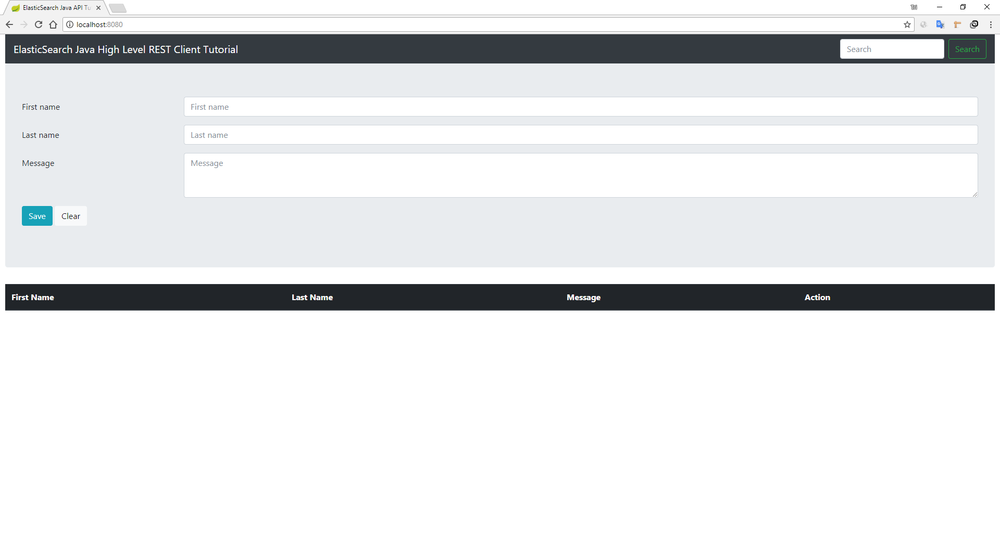

Original link: https://github.com/hakdogan/ElasticSearch

Make a separate service using spring-boot of Java, CRUD for data in ElasticSearch.

## How to Use Java High Level REST Client in the backend?
The client added in version 6.0.0-beta1 and it works on top of the Java low level rest client.

### Initialization
```java
RetHighLevelClient(RestClient.builder(new HttpHost(props.getRestClient().getHostname(),
                props.getRestClient().getPort(), props.getRestClient().getScheme())));
```


### Creating an index
```java
IndexRequest request = new IndexRequest(props.getIndex().getName(), props.getIndex().getType());
request.source(gson.toJson(document), XContentType.JSON);
IndexResponse response = client.index(request);
```

### Using SearchSourceBuilder and showing search results
```java
sourceBuilder.query(builder);
SearchRequest searchRequest = getSearchRequest();

SearchResponse searchResponse = client.search(searchRequest);
SearchHits hits = searchResponse.getHits();
SearchHit[] searchHits = hits.getHits();
for (SearchHit hit : searchHits) {
    Document doc = gson.fromJson(hit.getSourceAsString(), Document.class);
    doc.setId(hit.getId());
    result.add(doc);
}
```


### Deleting a document
```
DeleteRequest deleteRequest = new DeleteRequest(props.getIndex().getName(), props.getIndex().getType(), id);
```

## How to run?
```
mvn spring-boot:run
```


